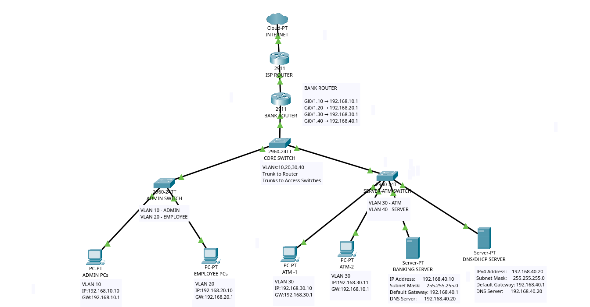
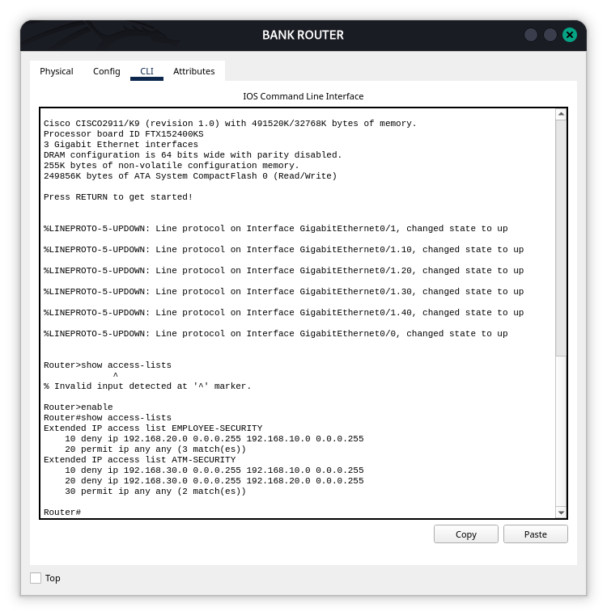

#  Bank Secure Network

A segmented, security-focused banking network designed and simulated in **Cisco Packet Tracer**, featuring VLAN segmentation, router-on-a-stick inter-VLAN routing, centralized DHCP/DNS, internal web services, and ACL-based network security.


>  **Jump to:** [Overview](#-overview) · [Architecture](#️-network-architecture) · [VLAN/IP Plan](#-vlan--ip-addressing) · [Services](#️-network-services) · [Security](#-security-architecture) · [Testing](#-testing--verification) · [Screenshots](#-screenshots) · [Documentation](#-documentation) · [Presentation](#-presentation)

---

##  Overview

**Bank Secure Network** is a personal portfolio project simulating the core network infrastructure of a small bank branch. It was built end-to-end in Cisco Packet Tracer to demonstrate practical, hands-on experience with enterprise networking and network security fundamentals — from physical topology design through VLAN segmentation, routing, centralized services, and access control.

The goal was to design a network where different types of banking traffic (administrative, employee, and ATM) are logically separated, routed correctly, and restricted from reaching resources they have no business need to access — while still allowing legitimate traffic (like access to the banking server) to flow.

##  Problem Statement

A flat, unsegmented network is a liability in any environment handling sensitive data — and especially in banking. Without segmentation and access control:

- ATMs, employee workstations, and administrative systems all share the same broadcast domain and attack surface.
- A compromised or misconfigured device on one segment can freely reach every other segment.
- There is no way to enforce least-privilege access between departments or device types.

This project addresses that problem by segmenting the network into functional VLANs and enforcing inter-VLAN access restrictions with ACLs, so that each segment can only reach what it legitimately needs.

##  Objectives

- Design a segmented network topology reflecting realistic banking network zones (Admin, Employee, ATM, Server).
- Implement VLAN segmentation with correctly assigned access ports.
- Configure 802.1Q trunking between switches.
- Implement router-on-a-stick for inter-VLAN routing.
- Deploy centralized DHCP with DHCP relay (`ip helper-address`) for remote VLANs.
- Deploy centralized DNS with internal name resolution for the banking server.
- Host an internal banking web server reachable via HTTP/HTTPS/FTP.
- Design and implement ACLs to restrict unnecessary inter-VLAN traffic while preserving required connectivity.
- Verify the entire design through structured connectivity, service, and ACL testing.

---

##  Network Architecture

The network is built around a single multilayer point of routing (router-on-a-stick) connected via a trunk to a switching layer that fans out into four VLANs: Admin, Employee, ATM, and Server.



*Bank Secure Network topology implemented in Cisco Packet Tracer.*

##  Network Components

| Component | Quantity | Role |
|---|---|---|
| Cisco 2911 Router | 1 | Router-on-a-stick / inter-VLAN routing |
| Cisco 2960-24TT Switch | 3 | Access + trunk switching |
| Banking Server | 1 | Internal banking web application (HTTP/HTTPS/FTP) |
| DNS/DHCP Server | 1 | Centralized DNS resolution and DHCP address assignment |
| Admin PC | 1 | Administrative access endpoint (VLAN 10) |
| Employee PC | 1 | Employee workstation endpoint (VLAN 20) |
| ATM (×2) | 2 | Simulated ATM terminals (VLAN 30) |
| Internet/Cloud | 1 | External network representation |

---

##  VLAN & IP Addressing

| VLAN | Name | Network | Gateway |
|---|---|---|---|
| 10 | ADMIN | 192.168.10.0/24 | 192.168.10.1 |
| 20 | EMPLOYEE | 192.168.20.0/24 | 192.168.20.1 |
| 30 | ATM | 192.168.30.0/24 | 192.168.30.1 |
| 40 | SERVER | 192.168.40.0/24 | 192.168.40.1 |

**Static server addressing:**

| Server | IP Address | Subnet Mask | Gateway | DNS |
|---|---|---|---|---|
| BANKING-SERVER | 192.168.40.10 | 255.255.255.0 | 192.168.40.1 | 192.168.40.20 |
| DNS/DHCP-SERVER | 192.168.40.20 | 255.255.255.0 | 192.168.40.1 | 192.168.40.20 |

 Full breakdown: [IP & VLAN Plan](./documentation/IP-VLAN-Plan.md)

---

##  Routing Architecture

Inter-VLAN routing is handled using **router-on-a-stick**: a single physical link from the Cisco 2911 router to the access-layer switch is configured as an 802.1Q trunk, with sub-interfaces created for each VLAN (10, 20, 30, 40) acting as that VLAN's default gateway.

This allows all four VLANs to communicate with each other (subject to ACL restrictions below) and reach the DHCP/DNS and banking services on VLAN 40, without requiring a dedicated router interface per VLAN.

 Full breakdown: [Network Design](./documentation/Network-Design.md)

---

## ⚙️ Network Services

| Service | Details |
|---|---|
| **DHCP** | Centralized DHCP server on VLAN 40 serves address pools for ADMIN, EMPLOYEE, and ATM VLANs |
| **DHCP Relay** | `ip helper-address` configured on router sub-interfaces so remote-VLAN clients can reach the centralized DHCP server |
| **DNS** | Centralized internal DNS resolves `banking.local` → `192.168.40.10` |
| **HTTP / HTTPS** | Banking web server reachable over both protocols |
| **FTP** | File service hosted on the banking server |

**DHCP pools:**

| Pool | Gateway | DNS | Starting IP | Subnet Mask |
|---|---|---|---|---|
| ADMIN | 192.168.10.1 | 192.168.40.20 | 192.168.10.10 | 255.255.255.0 |
| EMPLOYEE | 192.168.20.1 | 192.168.40.20 | 192.168.20.10 | 255.255.255.0 |
| ATM | 192.168.30.1 | 192.168.40.20 | 192.168.30.10 | 255.255.255.0 |

**Relevant screenshots:** `dhcp-server.png`, `dhcp-client.png`, `dns-config.png`, `dns-test.png`, `banking-server.png`

 Full breakdown: [Network Design](./documentation/Network-Design.md) · [IP & VLAN Plan](./documentation/IP-VLAN-Plan.md)

---

##  Security Architecture

VLAN segmentation alone only separates broadcast domains — it does not stop routed traffic from crossing between them. ACLs were applied at the router to enforce **least-privilege access** between VLANs: each segment can reach only what it needs to, and nothing more.

**Design intent:**

| ACL | Restricts | Preserves |
|---|---|---|
| `EMPLOYEE-SECURITY` | Employee (VLAN 20) → Admin (VLAN 10) traffic | Employee access to required services (e.g. Banking Server) |
| `ATM-SECURITY` | ATM (VLAN 30) → Admin (VLAN 10) traffic; ATM (VLAN 30) → Employee (VLAN 20) traffic | ATM access to the Banking Server (VLAN 40) |

>  **Pending exact values:** The specific ACL statements (permit/deny lines, source/destination networks, applied interface, direction, and match counters) need to be filled in directly from your router configuration or the `acl-testing.png` screenshot output. Rather than guess these, this section should be updated with the literal `show access-lists` output and interface assignment once available, so the documentation stays 100% accurate to the implementation.



*ACL verification and testing evidence — replace/confirm this caption once the exact screenshot content is documented.*

---

##  Testing & Verification

The following tests were performed to validate connectivity, services, and security enforcement:

| Test | Source | Destination | Expected Result | Actual Result | Status |
|---|---|---|---|---|---|
| DHCP address assignment | ADMIN / EMPLOYEE / ATM clients | DHCP Server (192.168.40.20) | Client receives valid lease | Pending — confirm from `dhcp-client.png` | ⬜ |
| DNS resolution | Client | DNS Server | `banking.local` resolves to 192.168.40.10 | Pending — confirm from `dns-test.png` | ⬜ |
| Banking web service access | Client | Banking Server (192.168.40.10) | HTTP/HTTPS page loads | Pending — confirm from `banking-server.png` | ⬜ |
| Employee → Banking Server | VLAN 20 | VLAN 40 | Permitted | Pending — confirm from ACL evidence | ⬜ |
| ATM → Banking Server | VLAN 30 | VLAN 40 | Permitted | Pending — confirm from ACL evidence | ⬜ |
| Employee → Admin restriction | VLAN 20 | VLAN 10 | Denied | Pending — confirm from `acl-testing.png` | ⬜ |
| ATM → Admin restriction | VLAN 30 | VLAN 10 | Denied | Pending — confirm from `acl-testing.png` | ⬜ |
| ATM → Employee restriction | VLAN 30 | VLAN 20 | Denied | Pending — confirm from `acl-testing.png` | ⬜ |
| ACL match counters / verification | Router | — | Counters increment on denied/permitted traffic | Pending — confirm from `acl-testing.png` | ⬜ |

> These tests were reported as completed. The **Actual Result** and **Status** columns should be updated with the literal outcomes shown in `acl-testing.png`, `dhcp-client.png`, and `dns-test.png` once transcribed — this keeps the table verifiably accurate rather than assumed.

 Full evidence: [Screenshots](./screenshots/)

---

##  Screenshots

| Screenshot | Description |
|---|---|
| [`topology.png`](./screenshots/topology.png) | Full physical/logical network topology |
| [`vlan-config.png`](./screenshots/vlan-config.png) | VLAN creation and access-port assignment |
| [`trunk-config.png`](./screenshots/trunk-config.png) | 802.1Q trunk configuration between switches |
| [`dhcp-server.png`](./screenshots/dhcp-server.png) | DHCP server pool configuration |
| [`dhcp-client.png`](./screenshots/dhcp-client.png) | Client-side DHCP address assignment |
| [`dns-config.png`](./screenshots/dns-config.png) | DNS server record configuration |
| [`dns-test.png`](./screenshots/dns-test.png) | DNS resolution test (`banking.local`) |
| [`banking-server.png`](./screenshots/banking-server.png) | Banking web server configuration/access |
| [`acl-testing.png`](./screenshots/acl-testing.png) | ACL configuration and traffic restriction testing |

 Browse all: [screenshots/](./screenshots/)

---

##  Technologies Used

| Category | Technology |
|---|---|
| Switching | VLANs, Access Ports, 802.1Q Trunking |
| Routing | Router-on-a-Stick, Inter-VLAN Routing |
| Addressing | IPv4, Subnetting |
| Services | DHCP, DHCP Relay, DNS, HTTP, HTTPS, FTP |
| Security | Access Control Lists (ACLs) |
| Simulation | Cisco Packet Tracer |

---

##  Project Structure

```
bank-secure-network/
│
├── README.md
│
├── packet-tracer/
│   ├── Bank-Secure-Network.pkt
│   └── README.md
│
├── documentation/
│   ├── Bank-Secure-Network-Documentation.pdf
│   ├── Network-Design.md
│   ├── IP-VLAN-Plan.md
│   └── README.md
│
├── screenshots/
│   ├── topology.png
│   ├── vlan-config.png
│   ├── trunk-config.png
│   ├── dhcp-server.png
│   ├── dhcp-client.png
│   ├── dns-config.png
│   ├── dns-test.png
│   ├── banking-server.png
│   ├── acl-testing.png
│   └── README.md
│
└── presentation/
    ├── Bank-Secure-Network.pptx
    └── README.md
```

- [📁 Packet Tracer](./packet-tracer/) — [`Bank-Secure-Network.pkt`](./packet-tracer/Bank-Secure-Network.pkt)
- [📁 Documentation](./documentation/)
- [📁 Screenshots](./screenshots/)
- [📁 Presentation](./presentation/)

---

##  How to Open the Project

1. Clone or download this repository.
2. Install [Cisco Packet Tracer](https://www.netacad.com/courses/packet-tracer) if you don't already have it.
3. Open [`packet-tracer/Bank-Secure-Network.pkt`](./packet-tracer/Bank-Secure-Network.pkt).
4. Inspect the topology and device placement.
5. Review the router, switch, and server configurations directly in Packet Tracer.
6. Cross-reference the [documentation](./documentation/) for design rationale and addressing.
7. Review the [screenshots](./screenshots/) for configuration and testing evidence.

---

##  Documentation

- 📄 [Technical Documentation (PDF)](./documentation/Bank-Secure-Network-Documentation.pdf)
- 📄 [Network Design](./documentation/Network-Design.md)
- 📄 [IP & VLAN Plan](./documentation/IP-VLAN-Plan.md)
- 📄 [Documentation Index](./documentation/README.md)

##  Presentation

-  [Presentation (PPTX)](./presentation/Bank-Secure-Network.pptx)
-  [Presentation README](./presentation/README.md)

---

##  Project Information

This is an independent, self-directed portfolio project designed, configured, and tested end-to-end as a hands-on exercise in networking and network security fundamentals.

##  Future Improvements

> The items below are **not implemented** — they are documented as planned future directions for the project.

- Dedicated firewall appliance
- IDS/IPS integration
- Stronger authentication mechanisms (AAA/RADIUS)
- Network monitoring and logging (e.g., SNMP, Syslog)
- Redundancy (HSRP/VRRP, redundant links)
- VPN connectivity for remote access
- Improved server-side hardening

##  Disclaimer

This project is an **educational simulation** built in Cisco Packet Tracer for learning and portfolio purposes only. It is **not** a production banking network and does not implement production-grade banking security controls. It should not be interpreted as representing enterprise-grade or regulatory-compliant banking infrastructure.
