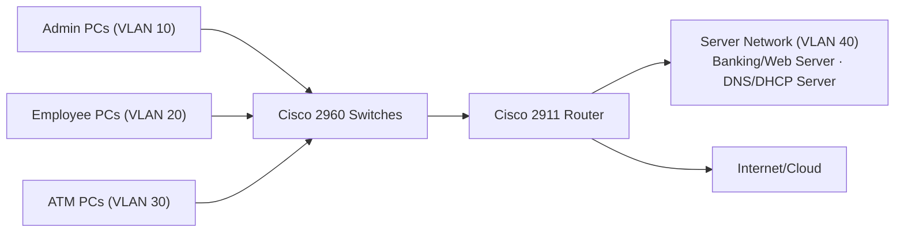

# Bank Secure Network — Network Design

## 1. Overview

The **Bank Secure Network** is a Computer Networks project designed and simulated in **Cisco Packet Tracer**. It models the network of a bank in which administrative users, employees, ATMs and core banking services must coexist while remaining logically separated from one another.

This document describes the **design and architecture** of the network: how it is structured, why it is structured that way, and how traffic moves through it. It does not cover device configuration commands.

---

## 2. Network Topology

The physical topology consists of the following devices:

| Component | Quantity / Detail |
|---|---|
| Internet/Cloud | External network connection |
| Router | Cisco 2911 |
| Switches | Three Cisco 2960 |
| End devices | Admin PCs, Employee PCs, ATM PCs |
| Servers | Banking/Web Server, DNS/DHCP Server |

**How the components are connected**

- The **Internet/Cloud** connects to the **Cisco 2911 router**, which forms the network's edge and its central point of routing.
- The router connects to the **Cisco 2960 switches**, which provide network access to the devices in the bank.
- **Admin PCs, Employee PCs and ATM PCs** connect to the switches as end devices.
- The **Banking/Web Server** and **DNS/DHCP Server** also connect through the switching layer and sit in the dedicated server segment.

**Overall flow:** end devices connect to the switches; the switches carry their traffic to the router; the router forwards traffic to the required server network or toward the Internet/Cloud.

> The exact port-to-port cabling is shown in the topology diagram (see [Section 11](#11-design-diagram)).

---

## 3. Logical Network Design

While the physical topology describes *how devices are cabled*, the logical design describes *how the network is divided*. The network is segmented into four VLANs, each serving a distinct group of devices.

| VLAN | Name | Why this segment exists |
|---|---|---|
| 10 | ADMIN | Groups administrative users so that management-level access is kept separate from everyday user traffic. |
| 20 | EMPLOYEE | Groups bank employees' workstations into their own segment for regular day-to-day operations. |
| 30 | ATM | Isolates ATM-related systems, which have different trust and access requirements from staff workstations. |
| 40 | SERVER | Hosts the banking and network services (Banking/Web Server and DNS/DHCP Server) in a dedicated segment. |

**How segmentation helps**

- **Organization:** devices are grouped by role, which makes the network easier to understand, address and manage.
- **Security:** each group is a separate broadcast and communication domain. Traffic between groups must pass through the router, where it can be controlled, rather than flowing freely across a single flat network.
- **Containment:** an issue in one segment (for example, unwanted broadcast traffic) does not automatically spread to the others.

---

## 4. Physical/Device Design

Each major component has a distinct role.

| Device | Role |
|---|---|
| **Cisco 2911 Router** | Provides Layer 3 routing between VLANs, acts as the default gateway for the user VLANs, and connects the internal network to the Internet/Cloud. |
| **Cisco 2960 Switches (×3)** | Provide Layer 2 connectivity for end devices and servers, and carry traffic for the separate VLANs. |
| **Admin PCs** | Workstations for administrative users (VLAN 10). |
| **Employee PCs** | Workstations for bank employees (VLAN 20). |
| **ATM PCs** | Simulated ATM systems (VLAN 30). |
| **Banking/Web Server** | Hosts the banking/web service that users and ATMs rely on (VLAN 40). |
| **DNS/DHCP Server** | Provides name resolution and dynamic IP addressing services to the network (VLAN 40). |

**In short:** switches connect and separate devices at Layer 2, the router connects the separated segments at Layer 3, and the servers provide the services that clients depend on.

---

## 5. IP Addressing & VLAN Design

| VLAN ID | VLAN Name | Purpose | Gateway | Relevant Network |
|---|---|---|---|---|
| 10 | ADMIN | Administrative users | 192.168.10.1 | 192.168.10.x |
| 20 | EMPLOYEE | Bank employees | 192.168.20.1 | 192.168.20.x |
| 30 | ATM | ATM-related systems | 192.168.30.1 | 192.168.30.x |
| 40 | SERVER | Banking and network services | Server network gateway | 192.168.40.x |

**Server addressing**

| Service | IP Address |
|---|---|
| DNS/DHCP Server | 192.168.40.20 |

> **Note:** This table lists only the addressing information defined for the project. Subnet masks, the VLAN 40 gateway address and other host addresses are not listed here.

---

## 6. Inter-VLAN Communication

Devices in different VLANs cannot communicate with each other at Layer 2. To exchange traffic, they must go through a Layer 3 device — in this design, the **Cisco 2911 router**.

**At a high level:**

1. A device sends traffic destined for another VLAN to its **default gateway** (for example, `192.168.10.1` for VLAN 10).
2. The router receives the traffic and makes a routing decision based on the destination network.
3. The router forwards the traffic toward the destination VLAN.

**Why controlled inter-VLAN communication is required**

VLANs must not be completely isolated, because clients still need access to shared services such as the banking server and the DNS/DHCP server. At the same time, they must not be completely open to one another. Routing all inter-VLAN traffic through a single point makes it possible to **allow the communication that is required and restrict the rest**, which is the purpose of ACL-based access control in this design (see [Section 8](#8-security-oriented-design)).

---

## 7. Server Network Design

The **Banking/Web Server** and **DNS/DHCP Server** are placed together in the dedicated **SERVER VLAN (VLAN 40)**.

**Reasons for this placement**

- **Isolation of critical services:** the servers hold the most sensitive and business-critical services. Keeping them out of the user and ATM segments reduces their exposure to those devices.
- **Single controlled entry point:** since clients must reach the servers through the router, access to the server network can be managed in one place.
- **Shared, central services:** all VLANs depend on the same DNS/DHCP and banking services, so a central, dedicated segment is a natural location for them.
- **Easier management:** grouping servers together keeps the addressing and administration of services simple and predictable.

---

## 8. Security-Oriented Design

The security of this design is based on two mechanisms:

**1. VLAN segmentation**
- Admin, employee, ATM and server devices are separated into different VLANs.
- Each group operates in its own segment, so communication between groups is not automatic.

**2. ACL-based access control**
- Because inter-VLAN traffic is routed, access control lists can be used to define which segments may communicate with each other and which may not.
- This turns the router into a policy point, allowing access to be limited according to the role of each segment.

**Scope of this design:** the security model documented here is limited to VLAN segmentation and ACL-based access control. Other security controls are outside the scope of this document and are not claimed as part of this design.

---

## 9. Network Design Flow

The logical flow of traffic through the network is:

1. **Users and ATMs** (Admin, Employee and ATM PCs) connect to the **switches**.
2. The **switches** keep each VLAN's traffic separate and pass it toward the **router**.
3. The **router** acts as the gateway for each VLAN and decides where the traffic should go.
4. Traffic is forwarded to the **required service or network**: the **server network (VLAN 40)** for banking and DNS/DHCP services, or the **Internet/Cloud** for external connectivity.

---

## 10. Design Rationale

A banking environment has requirements that a simple, flat network cannot meet well. This architecture addresses them as follows:

| Requirement | How the design addresses it |
|---|---|
| **Separation of roles** | Admin, employee, ATM and server devices each have their own VLAN. |
| **Protection of critical services** | Banking and network services are placed in a dedicated server VLAN. |
| **Controlled access** | All inter-VLAN traffic passes through the router, where ACLs can restrict it. |
| **Organized addressing** | Each VLAN has its own network and gateway, keeping the structure clear. |
| **Manageability** | A small, layered design (switches for access, one router for routing) is easy to understand, document and troubleshoot. |
| **Suitability for the project scope** | The design demonstrates core networking concepts — VLANs, inter-VLAN routing and access control — within Cisco Packet Tracer. |

---

## 11. Design Diagram

---

## 12. Summary

The Bank Secure Network uses a **Cisco 2911 router** and **three Cisco 2960 switches** to connect Admin, Employee and ATM devices to the banking services and the Internet/Cloud. The network is **logically divided into four VLANs** — ADMIN (10), EMPLOYEE (20), ATM (30) and SERVER (40) — so that each group of devices is separated from the others. The **router provides controlled inter-VLAN communication**, and combined with **VLAN segmentation and ACL-based access control**, this gives the bank a structured, organized and security-oriented network design.
